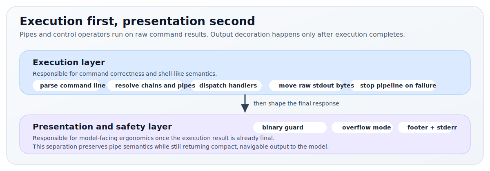

# one-tool

Single-tool CLI runtime for LLM agents.

`one-tool` gives a model exactly one tool:

```ts
run(command: string)
```

Behind that single entrypoint, the runtime provides:

- shell-like composition with `|`, `&&`, `||`, and `;`
- a rooted virtual file system
- adapter-backed retrieval and fetch commands
- model-friendly output formatting
- command discovery through `help`, usage text, and guided errors

It is designed for the common agent problem:

> You want the power of CLI-style composition without exposing a real shell.

Code examples below use package-style imports such as `import { createAgentCLI } from 'one-tool'` for consumer clarity. When working inside this repo, see `examples/` for the local relative-import versions.

---

## Table of contents

- [Why this library exists](#why-this-library-exists)
- [Choose your path](#choose-your-path)
- [Quick start](#quick-start)
- [Five-minute integration](#five-minute-integration)
- [How it works](#how-it-works)
- [Command language](#command-language)
- [Built-in commands](#built-in-commands)
- [Public API](#public-api)
- [VFS backends](#vfs-backends)
- [Output model](#output-model)
- [Provider-backed agent example](#provider-backed-agent-example)
- [Adding commands](#adding-commands)
- [Testing](#testing)
- [Project layout](#project-layout)
- [Design choices and non-goals](#design-choices-and-non-goals)

---

## Why this library exists

Many agent systems expose a large set of narrow tools:

- one tool for file reads
- one tool for file writes
- one tool for search
- one tool for HTTP
- one tool for JSON inspection
- one tool for memory

That often creates three problems:

1. The model has to discover and plan across too many tool boundaries.
2. Multi-step work becomes verbose and brittle.
3. Local reasoning patterns the model already knows from CLI workflows get lost.

`one-tool` takes the opposite approach:

- expose one tool
- make it feel like a small CLI
- keep execution safe and rooted
- make outputs compact, navigable, and recoverable

The result is a model-facing interface that is simpler, but often more capable.

---

## Choose your path

If you are:

- evaluating the idea, read [How it works](#how-it-works)
- integrating in Node, start with [Quick start](#quick-start) and [Five-minute integration](#five-minute-integration)
- building a browser agent, jump to [VFS backends](#vfs-backends)
- wiring model tool-calling, jump to [Public API](#public-api) and [Provider-backed agent example](#provider-backed-agent-example)
- adding built-in commands, jump to [Adding commands](#adding-commands)

---

## Quick start

### Requirements

- Node `>= 20.11`
- npm

### Run the repo locally

```bash
npm install
npm run build
npm run demo
```

The demo runtime seeds:

- a rooted workspace under `./agent_state`
- example files such as `/logs/app.log`, `/config/prod.json`, and `/accounts/acme.md`
- demo `search` and `fetch` adapters
- seeded in-memory working memory entries

Then try:

```text
help
ls /
cat /logs/app.log | grep -c ERROR
fetch order:123 | json get customer.email
search "refund timeout incident" | write /reports/refund.txt
```

For the provider-backed agent example or live integration tests:

```bash
cp .env.example .env
```

Then fill in either the Groq or OpenAI section.

---

## Five-minute integration

### Minimal Node example

```ts
import {
  buildToolDefinition,
  createAgentCLI,
  NodeVFS,
  SimpleMemory,
  type FetchAdapter,
  type FetchResponse,
  type SearchAdapter,
  type SearchHit,
} from 'one-tool';

class MySearch implements SearchAdapter {
  async search(query: string, limit = 10): Promise<SearchHit[]> {
    const rows = await mySearchBackend.search(query, { limit });
    return rows.map((row) => ({
      title: row.title,
      snippet: row.snippet,
      source: row.url,
    }));
  }
}

class MyFetch implements FetchAdapter {
  async fetch(resource: string): Promise<FetchResponse> {
    const payload = await myApi.lookup(resource);
    return {
      contentType: 'application/json',
      payload,
    };
  }
}

const runtime = await createAgentCLI({
  vfs: new NodeVFS('./agent_state'),
  adapters: {
    search: new MySearch(),
    fetch: new MyFetch(),
  },
  memory: new SimpleMemory(),
});

export async function run(command: string): Promise<string> {
  return runtime.run(command);
}

const tool = buildToolDefinition(runtime);
```

`mySearchBackend` and `myApi` are placeholders for your own services. The runtime surface stays the same whether those are local libraries, HTTP clients, databases, or SDK calls.

That is the entire model-facing surface:

<p align="center">
  
</p>

### Example result

For:

```text
cat /logs/app.log | grep -c ERROR
```

The model sees something like:

```text
3

[exit:0 | 2ms]
```

For a missing file:

```text
[error] cat: file not found: /notes/missing.txt. Use: ls /notes

[exit:1 | 0ms]
```

---

## How it works

### Mental model

The runtime is intentionally split into two layers:

<p align="center">
  
</p>

That separation matters.

If you decorate output too early, you break pipe semantics.

### Full architecture

<p align="center">
  
</p>

### Execution semantics

- stdout bytes flow through pipes
- stderr does not flow through pipes
- a pipeline stops on the first failed stage
- `&&`, `||`, and `;` control whether the next pipeline runs
- relative paths resolve under `/`
- there is no process environment, cwd mutation, or shell state

### What the model learns

The runtime intentionally makes discovery cheap:

- `help` lists commands
- `help <command>` gives details and examples
- calling a command with the wrong shape returns guided usage
- large output becomes navigable output, not useless output

---

## Command language

### Supported operators

| Operator | Meaning |
|---|---|
| `|` | pipe stdout to the next command |
| `&&` | run the next pipeline only if the previous one succeeded |
| `||` | run the next pipeline only if the previous one failed |
| `;` | always run the next pipeline |

Examples:

```text
cat /logs/app.log | grep ERROR | tail -n 20
cat /config/prod.json || cat /config/default.json
search "EU VAT" | head -n 5 | write /research/vat.txt
cp /drafts/qbr.md /reports/qbr-v1.md && ls /reports
```

### Quoting and escaping

The parser supports:

- single quotes
- double quotes
- backslash escaping

Examples:

```text
write /notes/todo.txt "line with spaces"
grep "payment timeout" /logs/app.log
calc (12 * 8) / 3
```

### Intentionally unsupported

This is not a real shell.

The parser rejects or does not implement:

- environment expansion
- globbing
- command substitution
- redirection
- backgrounding

Examples that are intentionally rejected:

```text
cat /logs/app.log > out.txt
echo $(whoami)
grep ERROR /logs/*.log
long_task &
```

Use command composition plus virtual files instead:

```text
cat /logs/app.log | grep ERROR | write /reports/errors.txt
```

### Path semantics

All command paths are rooted:

```text
/notes/todo.txt
/logs/app.log
/config/prod.json
```

Relative paths also resolve under `/`:

```text
notes/todo.txt   -> /notes/todo.txt
logs/app.log     -> /logs/app.log
```

There is no mutable current working directory.

---

## Built-in commands

The runtime ships with 18 built-in commands. They are grouped in code under `src/commands/groups/`.

### System commands

| Command | Usage | Stdin | Purpose |
|---|---|---:|---|
| `help` | `help [command]` | no | List commands or show detailed help |
| `memory` | `memory search <query> | memory recent [N] | memory store <text>` | yes | Store and search lightweight working memory |

Examples:

```text
help grep
memory store "Acme prefers Monday follow-ups"
memory search "Acme"
memory recent 5
```

### Filesystem commands

| Command | Usage | Stdin | Purpose |
|---|---|---:|---|
| `ls` | `ls [path]` | no | List a directory |
| `stat` | `stat <path>` | no | Show file metadata |
| `cat` | `cat <path>` | no | Read a text file |
| `write` | `write <path> [content]` | yes | Write a file from inline content or stdin |
| `append` | `append <path> [content]` | yes | Append to a file |
| `mkdir` | `mkdir <path>` | no | Create a directory and missing parents |
| `cp` | `cp <src> <dst>` | no | Copy a file or directory |
| `mv` | `mv <src> <dst>` | no | Move or rename a file or directory |
| `rm` | `rm <path>` | no | Delete a file or directory recursively |

Examples:

```text
ls /
stat /logs/app.log
cat /notes/todo.txt
write /reports/summary.txt "ready"
cat /logs/app.log | grep ERROR | write /reports/errors.txt
append /reports/summary.txt "next line"
mkdir /reports/daily/2026-03-13
cp /drafts/qbr.md /reports/qbr-v1.md
mv /reports/qbr-v1.md /archive/qbr.md
rm /scratch
```

### Text commands

| Command | Usage | Stdin | Purpose |
|---|---|---:|---|
| `grep` | `grep [-i] [-v] [-c] [-n] <pattern> [path]` | yes | Filter lines by regex |
| `head` | `head [-n N] [path]` | yes | Show first N lines |
| `tail` | `tail [-n N] [path]` | yes | Show last N lines |

Examples:

```text
grep ERROR /logs/app.log
cat /logs/app.log | grep -i timeout
head -n 20 /logs/app.log
tail -n 50 /logs/app.log
```

### Data commands

| Command | Usage | Stdin | Purpose |
|---|---|---:|---|
| `json` | `json pretty [path] | json keys [path] | json get <field.path> [path]` | yes | Inspect JSON |
| `calc` | `calc <expression>` | no | Evaluate safe arithmetic |

Examples:

```text
fetch order:123 | json pretty
fetch order:123 | json get customer.email
json keys /config/prod.json
calc (1499 * 1.2) / 100
```

### Adapter-backed commands

| Command | Usage | Stdin | Purpose |
|---|---|---:|---|
| `search` | `search <query>` | no | Query the configured search adapter |
| `fetch` | `fetch <resource>` | no | Query the configured fetch adapter |

Examples:

```text
search "refund timeout incident"
fetch order:123
fetch crm/customer/acme | json get owner.email
```

### Realistic workflows

#### Log triage

```text
cat /logs/app.log | grep ERROR | tail -n 20
```

#### Fallback config inspection

```text
cat /config/prod.json || cat /config/default.json
```

#### Search, distill, and persist

```text
search "Acme renewal risk" | head -n 5 | write /notes/acme-risk.txt
```

#### Structured fetch plus extraction

```text
fetch order:123 | json get customer.email
```

#### Memory loop

```text
cat /accounts/acme.md | head -n 3 | memory store
memory search "Acme owner"
```

---

## Public API

### Core runtime

#### `createAgentCLI(options)`

```ts
import { createAgentCLI, type AgentCLIOptions } from 'one-tool';
```

Creates a fully initialized runtime with built-in commands registered.

```ts
interface AgentCLIOptions {
  vfs: VFS;
  adapters?: ToolAdapters;
  memory?: SimpleMemory;
}
```

#### `AgentCLI`

```ts
class AgentCLI {
  readonly registry: CommandRegistry;
  readonly ctx: CommandContext;

  initialize(): Promise<void>;
  run(commandLine: string): Promise<string>;
  buildToolDescription(): string;
}
```

Most integrations only need:

- `runtime.run(commandLine)`
- `buildToolDefinition(runtime)`

Advanced integrations can also:

- inspect `runtime.registry`
- register custom commands
- access `runtime.ctx`

If you construct `new AgentCLI(options)` directly instead of using `createAgentCLI(options)`, call `await runtime.initialize()` before the first `run(...)` so the internal output directory exists.

### Tool definition

#### `buildToolDefinition(runtime, toolName?)`

```ts
import { buildToolDefinition } from 'one-tool';

const tool = buildToolDefinition(runtime);
```

Returns an OpenAI-compatible function-tool definition:

```ts
{
  type: 'function',
  function: {
    name: 'run',
    description: '...',
    parameters: {
      type: 'object',
      properties: {
        command: { type: 'string' }
      },
      required: ['command']
    }
  }
}
```

The generated description includes the runtime’s current command list, so register any custom commands before building the tool definition.

The exported `ToolDefinition` type matches this object shape.

### Adapters

```ts
interface SearchHit {
  title: string;
  snippet: string;
  source?: string;
}

interface SearchAdapter {
  search(query: string, limit?: number): Promise<SearchHit[]> | SearchHit[];
}

interface FetchResponse {
  contentType: string;
  payload: unknown;
}

interface FetchAdapter {
  fetch(resource: string): Promise<FetchResponse> | FetchResponse;
}

interface ToolAdapters {
  search?: SearchAdapter;
  fetch?: FetchAdapter;
}
```

`search` is intended for ranked textual results.

`fetch` is intended for exact-resource lookup returning text, JSON, or bytes.

### Memory

```ts
import { SimpleMemory } from 'one-tool';
```

`SimpleMemory` is an in-process, lightweight working-memory store used by the built-in `memory` command.

### Result helpers

For custom commands:

```ts
import { ok, okBytes, err } from 'one-tool';
```

Use:

- `ok(text)`
- `okBytes(bytes, contentType?)`
- `err(message, { exitCode? })`

### Command extension surface

For custom commands and advanced integrations, the main extension types are:

```ts
interface CommandSpec {
  name: string;
  summary: string;
  usage: string;
  details: string;
  handler: CommandHandler;
  acceptsStdin?: boolean;
  minArgs?: number;
  maxArgs?: number;
  requiresAdapter?: keyof ToolAdapters;
  conformanceArgs?: string[];
}

type CommandHandler = (
  ctx: CommandContext,
  args: string[],
  stdin: Uint8Array,
) => CommandResult | Promise<CommandResult>;
```

The metadata fields are optional in the public type, but built-in commands in this repo use them so the conformance suite can validate them automatically.

### Command registry

The command system is also exported directly:

```ts
import { CommandRegistry, registerBuiltinCommands } from 'one-tool';

const registry = new CommandRegistry();
registerBuiltinCommands(registry);
```

`CommandRegistry` supports:

- `register(spec)` to add a command
- `get(name)` to look up a command
- `all()` to list all registered specs in sorted order
- `names()` to list command names in sorted order

Most applications do not need to create a separate registry because `AgentCLI` already creates one and exposes it as `runtime.registry`.

### Browser import path

The package exposes a browser-specific subpath:

```ts
import { BrowserVFS } from 'one-tool/vfs/browser';
```

You can also import `BrowserVFS` from the root entrypoint when your environment supports it, but the subpath is the clearest browser-specific import.

---

## VFS backends

All backends implement the same `VFS` interface:

```ts
interface VFS {
  normalize(inputPath: string): string;
  exists(inputPath: string): Promise<boolean>;
  isDir(inputPath: string): Promise<boolean>;
  mkdir(inputPath: string, parents?: boolean): Promise<string>;
  listdir(inputPath?: string): Promise<string[]>;
  readBytes(inputPath: string): Promise<Uint8Array>;
  readText(inputPath: string): Promise<string>;
  writeBytes(inputPath: string, data: Uint8Array, makeParents?: boolean): Promise<string>;
  appendBytes(inputPath: string, data: Uint8Array, makeParents?: boolean): Promise<string>;
  delete(inputPath: string): Promise<string>;
  copy(src: string, dst: string): Promise<{ src: string; dst: string }>;
  move(src: string, dst: string): Promise<{ src: string; dst: string }>;
  stat(inputPath: string): Promise<VFileInfo>;
}
```

`stat(...)` returns:

```ts
interface VFileInfo {
  path: string;
  exists: boolean;
  isDir: boolean;
  size: number;
  mediaType: string;
  modifiedEpochMs: number;
}
```

### Backend comparison

| Backend | Best for | Persistence | Notes |
|---|---|---|---|
| `NodeVFS` | server/runtime agents | host filesystem under a chosen root | safest default for Node integrations |
| `MemoryVFS` | tests, demos, ephemeral agents | none | fast and deterministic |
| `BrowserVFS` | browser agents | IndexedDB | persistent client-side filesystem |

### `NodeVFS`

```ts
import { NodeVFS } from 'one-tool';

const vfs = new NodeVFS('./agent_state');
```

Behavior:

- all virtual paths are rooted under `rootDir`
- path escape is blocked
- directories are created on demand for writes by default
- deleting `/` is rejected

`RootedVFS` is still exported as a deprecated alias for `NodeVFS`.

### `MemoryVFS`

```ts
import { MemoryVFS } from 'one-tool';

const vfs = new MemoryVFS();
```

Behavior:

- fully in-memory
- ideal for tests and embedding into higher-level harnesses
- mirrors the same path semantics as the other backends

### `BrowserVFS`

```ts
import { createAgentCLI } from 'one-tool';
import { BrowserVFS } from 'one-tool/vfs/browser';

const vfs = await BrowserVFS.open('my-agent-db');
const runtime = await createAgentCLI({ vfs });
```

Behavior:

- stored in IndexedDB
- survives reloads
- isolated by database name

Cleanup:

```ts
vfs.close();
await BrowserVFS.destroy('my-agent-db');
```

### Virtual workspace example

The model sees a workspace that feels local:

<p align="center">
  
</p>

That workspace might be backed by:

- a real directory on disk
- an in-memory map
- a browser IndexedDB database

The model does not need to care.

---

## Output model

The runtime returns one formatted string per `run(...)` call.

### Successful text output

```text
Customer: Acme Corp
Status: renewal at risk

[exit:0 | 2ms]
```

### User-facing command errors

```text
[error] cat: file not found: /notes/missing.txt. Use: ls /notes

[exit:1 | 0ms]
```

### Binary guard

If a command produces binary bytes, the runtime stores them and returns guidance:

```text
[error] command produced binary output that should not be sent to the model.
Saved to: /.system/cmd-output/cmd-0001.bin
Use: stat /.system/cmd-output/cmd-0001.bin

[exit:0 | 1ms]
```

### Overflow handling

If output exceeds 200 lines or 50KB, the runtime stores the full text and returns a preview:

```text
[first preview chunk]

--- output truncated (5000 lines, 245.3KB) ---
Full output: /.system/cmd-output/cmd-0003.txt
Explore: cat /.system/cmd-output/cmd-0003.txt | grep <pattern>
         cat /.system/cmd-output/cmd-0003.txt | tail -n 100

[exit:0 | 45ms]
```

This is a major part of the design: large results become explorable, not destructive to the context window.

---

## Provider-backed agent example

This repo includes a real provider-backed example agent in `examples/agent.ts`.

Run it with:

```bash
npm run agent
```

Force a provider explicitly:

```bash
AGENT_PROVIDER=groq npm run agent
AGENT_PROVIDER=openai npm run agent
```

Provider selection rules:

- if `AGENT_PROVIDER` is unset and `GROQ_API_KEY` exists, Groq is preferred
- otherwise if `OPENAI_API_KEY` exists, OpenAI is used
- `AGENT_PROVIDER=groq` forces Groq
- `AGENT_PROVIDER=openai` forces OpenAI
- invalid `AGENT_PROVIDER` values fail fast

Recommended `.env` setups:

```bash
# Groq
GROQ_API_KEY=gsk_...
GROQ_MODEL=openai/gpt-oss-120b

# OpenAI
AGENT_PROVIDER=openai
OPENAI_API_KEY=sk-...
OPENAI_MODEL=gpt-5.2
```

Live integration tests are opt-in:

```bash
npm run test:live
npm run test:live:groq
npm run test:live:openai
```

Optional endpoint overrides:

- `GROQ_BASE_URL` overrides the Groq endpoint
- `OPENAI_BASE_URL` overrides the OpenAI endpoint

---

## Adding commands

Built-in commands are metadata-driven.

Each `CommandSpec` can declare:

- stdin behavior
- min/max argument bounds
- adapter dependencies
- representative sample args for automatic conformance tests

The repo conformance suite at `test/commands/conformance.test.ts` generates baseline tests automatically for every registered built-in command in the registry under test.

For the full workflow, examples, and checklist, see:

- `COMMANDS.md`

### Registering a custom command at runtime

```ts
import { err, ok, type CommandContext, type CommandSpec } from 'one-tool';

async function cmdEcho(_ctx: CommandContext, args: string[], stdin: Uint8Array) {
  if (stdin.length > 0) {
    return err('echo: does not accept stdin');
  }
  if (args.length === 0) {
    return err('echo: usage: echo <text...>');
  }
  return ok(args.join(' '));
}

const echo: CommandSpec = {
  name: 'echo',
  summary: 'Echo arguments back as output.',
  usage: 'echo <text...>',
  details: 'Examples:\n  echo hello world',
  handler: cmdEcho,
};

runtime.registry.register(echo);
```

If you expose tool definitions to the model, register custom commands before calling `buildToolDefinition(runtime)`.

If you want custom commands to receive the same conformance coverage pattern, build a test registry that includes them and run the same style of metadata-driven tests described in `COMMANDS.md`.

---

## Testing

### Main test suite

```bash
npm test
```

The suite covers:

- runtime parsing, chaining, and piping
- VFS parity across backends
- built-in command behavior
- metadata-driven command conformance
- provider support with offline tests

### Conformance tests

`test/commands/conformance.test.ts` automatically checks every registered built-in command in the registry under test for:

- valid metadata
- no-throw representative calls
- help coverage
- stdin rejection when declared
- arg bound enforcement when declared
- adapter error behavior when declared

### Demo commands

```bash
npm run demo
```

### Provider-backed example

```bash
npm run agent
```

### Live provider tests

```bash
npm run test:live
npm run test:live:groq
npm run test:live:openai
```

---

## Project layout

```text
one-tool/
├─ .env.example
├─ COMMANDS.md
├─ package.json
├─ README.md
├─ docs/
│  └─ diagrams/
│     ├─ execution-layers.svg
│     ├─ runtime-architecture.svg
│     ├─ tool-surface.svg
│     └─ vfs-workspace.svg
├─ src/
│  ├─ index.ts
│  ├─ runtime.ts
│  ├─ parser.ts
│  ├─ tool-schema.ts
│  ├─ types.ts
│  ├─ memory.ts
│  ├─ utils.ts
│  ├─ commands/
│  │  ├─ core.ts
│  │  ├─ register.ts
│  │  ├─ index.ts
│  │  ├─ groups/
│  │  └─ shared/
│  └─ vfs/
│     ├─ index.ts
│     ├─ interface.ts
│     ├─ node-vfs.ts
│     ├─ memory-vfs.ts
│     ├─ browser-vfs.ts
│     └─ path-utils.ts
├─ examples/
│  ├─ demo-runtime.ts
│  ├─ demo-adapters.ts
│  ├─ demo-app.ts
│  ├─ agent-support.ts
│  └─ agent.ts
└─ test/
   ├─ runtime.test.ts
   ├─ fetch-command.test.ts
   ├─ utils.test.ts
   ├─ memory-vfs.test.ts
   ├─ browser-vfs.test.ts
   ├─ node-vfs.test.ts
   ├─ agent-support.test.ts
   ├─ agent-live.integration.ts
   └─ commands/
      ├─ harness.ts
      ├─ conformance.test.ts
      ├─ system.test.ts
      ├─ fs.test.ts
      ├─ text.test.ts
      ├─ data.test.ts
      └─ adapters.test.ts
```

---

## Design choices and non-goals

### Deliberate choices

- one model-facing tool instead of many narrow tools
- shell-like composition without a shell
- rooted paths instead of ambient host filesystem access
- bytes through pipes, formatting after execution
- async internals so adapters and storage can await real systems
- guided errors instead of silent failures

### Non-goals

- full shell compatibility
- arbitrary process spawning
- shell redirection semantics
- globbing and environment expansion
- hidden mutable runtime state like a working directory

### Why async everywhere

The model still sees:

```ts
run(command: string)
```

But commands can await:

- databases
- web APIs
- search services
- object storage
- queues
- RPC systems

without changing the model-facing tool shape.

---

## Suggested next extensions

If you want to grow this runtime, useful next command families include:

- `find`
- `sort`
- `uniq`
- `wc`
- `template`
- `table`
- `csv`
- `http`
- `sql`
- richer memory primitives
- topic-scoped file roots
- per-command auth policies
- rate limits and cost budgets

---

## Core takeaway

Expose one tool:

```ts
run(command: string)
```

Make discovery happen through:

- command help
- usage text
- explicit errors
- consistent output format

Keep execution shell-free.

Keep files rooted.

Keep outputs model-friendly.

That preserves most of the value of CLI composition without inheriting the risks of a real shell.
