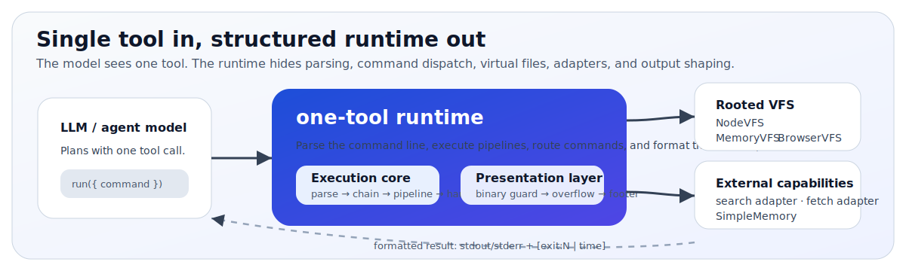
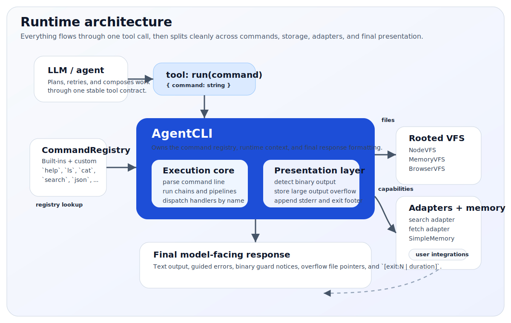

# one-tool

Constrained agent workspace that avoids Python and shell sandboxes.

`one-tool` gives a model exactly one tool:

```ts
run(command: string)
```

Behind that one entrypoint, the runtime provides:

- shell-like composition with `|`, `&&`, `||`, and `;`
- a rooted virtual file system
- adapter-backed retrieval and fetch commands
- model-friendly output formatting
- command discovery through `help`, usage text, and guided errors

It is built for the common agent problem:

> You want the power of CLI-style composition without exposing a real shell.

Some built-in commands aim for a measured GNU-style subset. Others are Unix-inspired commands shaped by the rooted workspace model, or product-native commands such as `memory`, `json`, `search`, and `fetch`. The command reference and compatibility matrix make that boundary explicit.

At a glance:

- one model-facing tool: `run(command)`
- 26 built-in commands for files, text, data, memory, and adapters
- rooted storage through `NodeVFS`, `MemoryVFS`, or `BrowserVFS`
- structured execution via `runDetailed(...)`
- extension helpers for custom commands
- testing helpers for command and scenario coverage
- MCP server support for Claude Code and other MCP clients

**[Try the interactive demo &rarr;](https://yshaaban.github.io/one-tool/)**

<p align="center">
  
</p>

---

## Documentation map

- Start here:
  - [Why this library exists](#why-this-library-exists)
  - architecture principles in [`docs/architecture-principles.md`](docs/architecture-principles.md)
  - [Quick start](#quick-start)
  - [Five-minute integration](#five-minute-integration)
- Command reference:
  - [Command language overview](#command-language)
  - [Built-in command groups](#built-in-command-groups)
  - full command reference in [`docs/command-reference.md`](docs/command-reference.md)
  - GNU-style compatibility target in [`docs/parity/gnu-command-parity.md`](docs/parity/gnu-command-parity.md)
  - compatibility intent and supported GNU-style subset in [`docs/parity/compatibility-matrix.md`](docs/parity/compatibility-matrix.md)
- API and integration reference:
  - [`docs/api.md`](docs/api.md)
  - [`examples/README.md`](examples/README.md)
  - [`docs/vfs.md`](docs/vfs.md)
  - [`docs/providers.md`](docs/providers.md)
- Release notes:
  - [`CHANGELOG.md`](CHANGELOG.md)
- Command authoring:
  - [`COMMANDS.md`](COMMANDS.md)
  - runnable example: `npm run example:custom-command`
  - public helper surface: `@onetool/one-tool/extensions`

---

## Why this library exists

Many agent systems expose a large set of narrow tools:

- one tool for file reads
- one tool for file writes
- one tool for search
- one tool for HTTP
- one tool for JSON inspection
- one tool for memory

That often creates three problems:

1. The model has to discover and plan across too many tool boundaries.
2. Multi-step work becomes verbose and brittle.
3. CLI-style reasoning patterns get lost.

`one-tool` takes the opposite approach:

- expose one tool
- make it feel like a small CLI
- keep execution safe and rooted
- make outputs compact, navigable, and recoverable

The result is a model-facing interface that is simpler, but still expressive.

It is a practical alternative to code-interpreter style sandboxes when you need:

- lower infrastructure cost
- a smaller execution surface
- easier multi-tenant control
- browser or middleware deployment without arbitrary code execution

### When this fits

Use `one-tool` when:

- you want one stable tool surface instead of many narrow tools
- your agent needs to compose file, text, JSON, memory, and retrieval work in one step
- you want a safer rooted workspace instead of a real shell
- you need deterministic command behavior that is easy to test
- you want a browser-, middleware-, or server-friendly alternative to code-interpreter or shell sandboxes

Look elsewhere when:

- you need arbitrary process execution
- you need full shell compatibility, redirection, or job control
- you need a streaming terminal or interactive TTY applications

---

## Quick start

### Requirements

- Node `>= 20.11`
- npm

### Install from npm

```bash
npm install @onetool/one-tool
```

### Run the repo locally

```bash
git clone https://github.com/yshaaban/one-tool.git
cd one-tool
npm install
npm run build
npm run demo
```

`npm run demo` runs the smallest self-contained example: `examples/01-hello-world.ts`.

For the rest of the walkthrough, open [`examples/README.md`](examples/README.md).

### Python package support

`one-tool` now includes a supported Python package under [`python/`](python). The TypeScript runtime remains the source of truth, and the Python package is maintained against TypeScript-generated golden snapshots plus differential tests.

Package-specific notes live in [`python/README.md`](python/README.md).

You can use it in Python projects today without waiting for PyPI publishing:

```bash
python -m pip install ./python
python -m pip install "git+https://github.com/yshaaban/one-tool.git#subdirectory=python"
```

Run the Python suite with:

```bash
cd python
python3 -m pip install -e ".[dev]"
pytest -q
```

The Python package currently includes the supported runtime, command layer, testing helpers, `MemoryVFS`, and `LocalVFS`.

Start with:

```bash
npm run build
npm run demo
npm run example:custom-command
npm run example:readonly-agent
```

Then continue with:

- `npm run example:detailed-execution` for traces and structured output
- `npm run example:adapters` for `search` and `fetch`
- `npm run example:mcp-server` for Claude Code / MCP integration

For the provider-backed agent example or live integration tests:

```bash
cp .env.example .env
```

Then fill in the Groq, OpenAI, or Anthropic section described in [`docs/providers.md`](docs/providers.md).

For the example walkthrough, see [`examples/README.md`](examples/README.md).

### Snapshot and parity workflow

TypeScript is the source of truth for command, runtime, and scenario behavior. The parity loop is:

```bash
npm run snapshots
npm run snapshots:check
(cd python && pytest -q)
```

When TypeScript behavior changes:

1. Update the TypeScript source.
2. Regenerate snapshots with `npm run snapshots`.
3. Commit the snapshot diffs.
4. Port the same behavior to Python until `(cd python && pytest -q)` is green again.

The generated corpus now covers parser, VFS, utils, commands, runtime executions/tool descriptions, and oracle scenarios under [`snapshots/`](snapshots).

---

## Five-minute integration

### Minimal Node example

```ts
import {
  buildToolDefinition,
  createAgentCLI,
  NodeVFS,
  SimpleMemory,
  type FetchAdapter,
  type FetchResponse,
  type SearchAdapter,
  type SearchHit,
} from '@onetool/one-tool';

class MySearch implements SearchAdapter {
  async search(query: string, limit = 10): Promise<SearchHit[]> {
    const rows = await mySearchBackend.search(query, { limit });
    return rows.map((row) => ({
      title: row.title,
      snippet: row.snippet,
      source: row.url,
    }));
  }
}

class MyFetch implements FetchAdapter {
  async fetch(resource: string): Promise<FetchResponse> {
    const payload = await myApi.lookup(resource);
    return {
      contentType: 'application/json',
      payload,
    };
  }
}

const runtime = await createAgentCLI({
  vfs: new NodeVFS('./agent_state'),
  adapters: {
    search: new MySearch(),
    fetch: new MyFetch(),
  },
  memory: new SimpleMemory(),
});

export async function run(command: string): Promise<string> {
  return runtime.run(command);
}

const tool = buildToolDefinition(runtime);
```

`mySearchBackend` and `myApi` are placeholders for your own services. The runtime surface stays the same whether those are local libraries, HTTP clients, databases, or SDK calls.

### Example result

For:

```text
cat /logs/app.log | grep -c ERROR
```

The model sees something like:

```text
3

[exit:0 | 2ms]
```

For a missing file:

```text
[error] cat: file not found: /notes/missing.txt. Use: ls /notes

[exit:1 | 0ms]
```

For complete API details, see [`docs/api.md`](docs/api.md).

### Why this shape works well for agents

| Approach         | What you get                                 | Main tradeoff                                |
| ---------------- | -------------------------------------------- | -------------------------------------------- |
| Code interpreter | arbitrary code execution                     | expensive, harder to secure, harder to scale |
| Real shell       | familiar process-level power                 | large risk surface and inconsistent outputs  |
| `one-tool`       | constrained, composable workspace for agents | intentionally narrower than Python or shell  |

The trade is deliberate: less raw power than arbitrary code execution, but much tighter control and a much simpler operating model.

---

## Common questions

### Why one tool instead of many?

Because the model usually reasons better over one composable tool than a large menu of narrow tools.

- one `run(command)` tool means one schema to understand
- command discovery happens inside the runtime through `help`, usage text, and errors
- compositions like `cat /logs/app.log | grep ERROR | head -n 5` stay in one tool call instead of three
- fewer round trips usually means less brittle planning and less context churn

### How do I choose which commands to enable?

Start with presets:

- `full`
- `readOnly`
- `filesystem`
- `textOnly`
- `dataOnly`

Then refine with explicit includes, excludes, or a custom registry.

Examples and full registry options are documented in [`docs/api.md#command-registry`](docs/api.md#command-registry).

### Which VFS should I use?

| Scenario               | Backend      | Why                                      |
| ---------------------- | ------------ | ---------------------------------------- |
| Server-side agent      | `NodeVFS`    | Persists to disk and survives restarts   |
| Unit tests             | `MemoryVFS`  | Fast, deterministic, no cleanup required |
| Browser agent          | `BrowserVFS` | IndexedDB-backed persistence             |
| Ephemeral/stateless    | `MemoryVFS`  | No persistence overhead                  |
| Long-lived local agent | `NodeVFS`    | Workspace survives process restarts      |

Full backend details: [`docs/vfs.md`](docs/vfs.md)

### Can I add custom commands?

Yes.

- authoring guide: [`COMMANDS.md`](COMMANDS.md)
- runnable custom example: `npm run example:custom-command`
- public helper surface: `@onetool/one-tool/extensions`
- API details: [`docs/api.md#command-extension-surface`](docs/api.md#command-extension-surface)

### How do I inspect execution programmatically?

Use `runtime.runDetailed(commandLine)`.

It returns:

- raw stdout bytes
- structured stderr and exit code
- per-command trace data for pipelines and chained commands
- presentation metadata for truncation and binary-guard cases

Reference: [`docs/api.md#structured-execution`](docs/api.md#structured-execution)

### Where should I start with the examples?

- start with [`examples/README.md`](examples/README.md)
- read the numbered examples in order
- use `examples/advanced/` when you need a narrower pattern after the basics

### Does this work with my model provider?

The runtime itself is provider-agnostic.

- OpenAI: covered by maintained example and live-test entrypoint
- Groq: covered by maintained example and live-test entrypoint
- Anthropic: covered by maintained example and live-test entrypoint through Anthropic's OpenAI-compatible endpoint
- other OpenAI-compatible providers: often usable if they support tool calling, but not covered by maintained examples or tests in this repo

Provider details: [`docs/providers.md`](docs/providers.md)

---

## How it works

<p align="center">
  
</p>

Execution semantics:

- stdout bytes flow through pipes
- stderr does not flow through pipes
- a pipeline stops on the first failed stage
- `&&`, `||`, and `;` control whether the next pipeline runs
- relative paths resolve under `/`
- there is no process environment, cwd mutation, or shell state

Operationally, think of the runtime as:

1. one parser for CLI-style commands
2. one registry of allowed commands
3. one rooted workspace
4. optional retrieval adapters and memory
5. one formatter that turns results into model-friendly text or structured execution data

For the architectural rules, layer boundaries, and contributor do/don'ts that keep this model coherent, see
[`docs/architecture-principles.md`](docs/architecture-principles.md).

The runtime intentionally makes discovery cheap:

- `help` lists commands
- `help <command>` gives details and examples
- calling a command with the wrong shape returns guided usage
- large output becomes navigable output, not useless output

---

## Command language

Supported operators:

| Operator            | Meaning                                                  |
| ------------------- | -------------------------------------------------------- |
| `<code>\|</code>`   | pipe stdout to the next command                          |
| `&&`                | run the next pipeline only if the previous one succeeded |
| `<code>\|\|</code>` | run the next pipeline only if the previous one failed    |
| `;`                 | always run the next pipeline                             |

The parser also supports:

- single quotes
- double quotes
- backslash escaping

This is intentionally not a real shell. It does not implement:

- environment expansion
- globbing
- command substitution
- redirection
- backgrounding

All paths are rooted under `/`. Relative paths also resolve under `/`.

Full syntax, unsupported constructs, and examples: [`docs/command-reference.md#command-language`](docs/command-reference.md#command-language)

For the GNU-style subset we support and the oracle-backed compatibility contract, see:

- [`docs/parity/gnu-command-parity.md`](docs/parity/gnu-command-parity.md)
- [`docs/parity/compatibility-matrix.md`](docs/parity/compatibility-matrix.md)

---

## Built-in command groups

The runtime ships with 26 built-in commands.

| Group      | Commands                                                                          | Reference                                                                                                |
| ---------- | --------------------------------------------------------------------------------- | -------------------------------------------------------------------------------------------------------- |
| System     | `help`, `memory`                                                                  | [`docs/command-reference.md#system-commands`](docs/command-reference.md#system-commands)                 |
| Filesystem | `ls`, `stat`, `cat`, `write`, `append`, `mkdir`, `cp`, `diff`, `mv`, `rm`, `find` | [`docs/command-reference.md#filesystem-commands`](docs/command-reference.md#filesystem-commands)         |
| Text       | `echo`, `grep`, `head`, `tail`, `sort`, `sed`, `tr`, `uniq`, `wc`                 | [`docs/command-reference.md#text-commands`](docs/command-reference.md#text-commands)                     |
| Data       | `json`, `calc`                                                                    | [`docs/command-reference.md#data-commands`](docs/command-reference.md#data-commands)                     |
| Adapters   | `search`, `fetch`                                                                 | [`docs/command-reference.md#adapter-backed-commands`](docs/command-reference.md#adapter-backed-commands) |

Example workflows:

```text
cat /logs/app.log | grep ERROR | tail -n 20
find /config -type f -name "*.json" | sort
sed -n "1,20p" /logs/app.log
diff -u /drafts/qbr.md /reports/qbr.md
search "Acme renewal risk" | head -n 5 | write /notes/acme-risk.txt
fetch order:123 | json get customer.email
```

Full command tables, examples, and workflows: [`docs/command-reference.md`](docs/command-reference.md)

GNU-style compatibility notes and the supported subset matrix:

- [`docs/parity/gnu-command-parity.md`](docs/parity/gnu-command-parity.md)
- [`docs/parity/compatibility-matrix.md`](docs/parity/compatibility-matrix.md)

---

## Public API

Primary entrypoints:

| Surface                                          | Purpose                                                      | Reference                                                                      |
| ------------------------------------------------ | ------------------------------------------------------------ | ------------------------------------------------------------------------------ |
| `createAgentCLI(...)`                            | create a runtime                                             | [`docs/api.md#core-runtime`](docs/api.md#core-runtime)                         |
| `runtime.runDetailed(...)`                       | inspect structured execution results and traces              | [`docs/api.md#structured-execution`](docs/api.md#structured-execution)         |
| `buildToolDefinition(...)`                       | expose an OpenAI-compatible tool definition                  | [`docs/api.md#tool-definition`](docs/api.md#tool-definition)                   |
| `@onetool/one-tool/mcp`                          | expose the runtime as an MCP stdio tool server               | [`docs/api.md#mcp-server-surface`](docs/api.md#mcp-server-surface)             |
| `CommandRegistry` / `createCommandRegistry(...)` | select, override, and compose commands                       | [`docs/api.md#command-registry`](docs/api.md#command-registry)                 |
| `@onetool/one-tool/extensions`                   | author custom commands with stable helper utilities          | [`docs/api.md#public-extension-helpers`](docs/api.md#public-extension-helpers) |
| `@onetool/one-tool/testing`                      | test custom commands and deterministic scenario runs         | [`docs/api.md#command-testing-helpers`](docs/api.md#command-testing-helpers)   |
| package subpaths                                 | import focused surfaces like `@onetool/one-tool/vfs/browser` | [`docs/api.md#package-exports`](docs/api.md#package-exports)                   |

Most integrations only need:

- `runtime.run(commandLine)`
- `buildToolDefinition(runtime)`

When you need observability, test assertions, or per-step telemetry, use `runtime.runDetailed(commandLine)` instead of parsing the formatted string from `run(...)`.

Full API reference: [`docs/api.md`](docs/api.md)

---

## VFS backends

All backends implement the same `VFS` interface.

| Backend      | Best for                       | Persistence                         | Notes                                                                    |
| ------------ | ------------------------------ | ----------------------------------- | ------------------------------------------------------------------------ |
| `NodeVFS`    | server/runtime agents          | host filesystem under a chosen root | rooted host storage; hides symlink entries and rejects symlink traversal |
| `MemoryVFS`  | tests, demos, ephemeral agents | none                                | fast and deterministic                                                   |
| `BrowserVFS` | browser agents                 | IndexedDB                           | persistent client-side filesystem                                        |

Full interface, backend behavior, and workspace model: [`docs/vfs.md`](docs/vfs.md)

---

## Provider-backed agent example

This repo includes a maintained provider-backed example agent in `examples/08-llm-agent.ts`.

```bash
npm run agent
```

Live integration tests are opt-in:

```bash
npm run test:live
npm run test:live:groq
npm run test:live:openai
npm run test:live:anthropic
```

Environment setup, provider selection, and compatibility notes: [`docs/providers.md`](docs/providers.md)

If you want the smallest maintained end-to-end path:

- `npm run agent` for a provider-backed agent loop
- `npm run example:mcp-server` for MCP / Claude Code integration
- `npm run example:custom-command` for extending the runtime

---

## Security model

The runtime is intentionally safer than exposing a real shell, but it is not a complete sandbox.

What it does:

- roots all file paths under `/`
- blocks path escape through normalization
- rejects symlink traversal inside `NodeVFS`
- rejects shell features such as redirection, subshells, backticks, and environment expansion
- never spawns host processes
- routes network access through explicit developer-supplied adapters

What still matters:

- `NodeVFS` touches a real host directory under the root you choose
- storage policies and output truncation do not by themselves cap how much command input may be materialized; use `executionPolicy.maxMaterializedBytes` when you need that bound
- `fetch` and `search` can reach real systems if your adapters do
- custom commands can do anything your code does

For production use, treat adapters and custom commands as your trust boundary.

---

## Adding commands

Built-in commands in this repo use metadata-driven conformance coverage, and the same conformance helper is exposed for downstream consumers.

For command authoring:

- full guide: [`COMMANDS.md`](COMMANDS.md)
- runnable example: `npm run example:custom-command`
- API details: [`docs/api.md#command-extension-surface`](docs/api.md#command-extension-surface)

Register custom commands before calling `buildToolDefinition(runtime)` if the model should see them in the generated tool description.

---

## Testing

Main entrypoints:

```bash
npm test
npm run demo
npm run example:custom-command
npm run agent
```

`npm test` includes both deterministic contract tests and deterministic end-to-end scenario tests.

Live provider tests:

```bash
npm run test:live
npm run test:live:groq
npm run test:live:openai
```

Testing helpers and conformance utilities are documented in [`docs/api.md#command-testing-helpers`](docs/api.md#command-testing-helpers). Command authoring patterns live in [`COMMANDS.md`](COMMANDS.md).

---

## Project layout

```text
one-tool/
├─ README.md
├─ COMMANDS.md
├─ CHANGELOG.md
├─ docs/
│  ├─ api.md
│  ├─ command-reference.md
│  ├─ providers.md
│  ├─ vfs.md
│  └─ diagrams/
├─ examples/
├─ python/
├─ scripts/
├─ snapshots/
├─ src/
└─ test/
```

---

## Known limitations

- `run(...)` returns a complete formatted string, not a streaming result
- output formatting is fixed even though the overflow thresholds are configurable
- built-in adapters are limited to `search` and `fetch`; other integrations should be custom commands
- the library does not manage your outer agent loop, retries, token budgets, or provider cost tracking
- access control is at command granularity; if you need subcommand-level policy, expose a narrower command

### Non-goals

- full shell compatibility
- arbitrary process spawning
- shell redirection semantics
- globbing and environment expansion
- hidden mutable runtime state like a working directory
