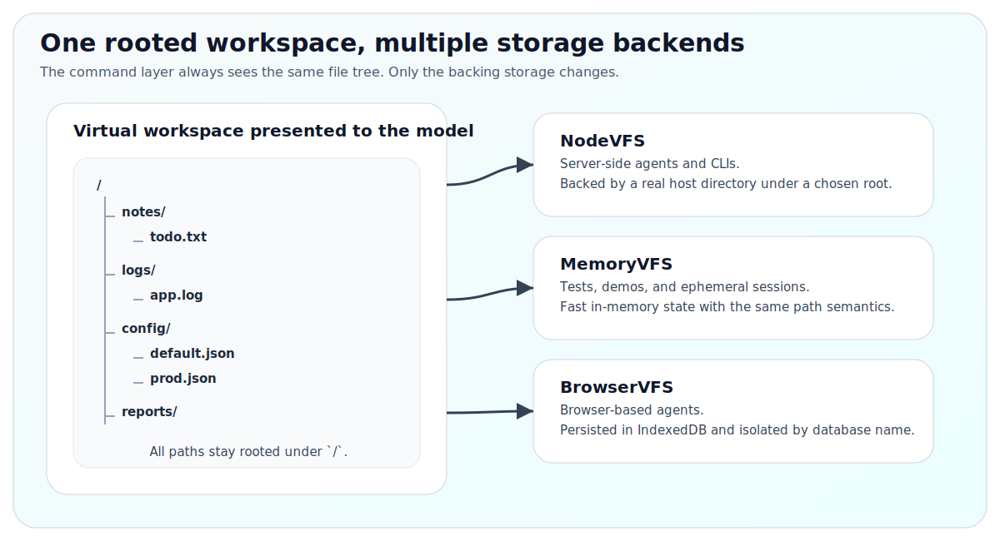

# VFS Guide

Guide to the virtual filesystem layer used by `one-tool`.

For the top-level overview, start with [`../README.md`](../README.md). For API reference, see [`api.md`](api.md).

---

## VFS interface

All backends implement the same `VFS` interface:

```ts
interface VFS {
  normalize(inputPath: string): string;
  exists(inputPath: string): Promise<boolean>;
  isDir(inputPath: string): Promise<boolean>;
  mkdir(inputPath: string, parents?: boolean): Promise<string>;
  listdir(inputPath?: string): Promise<string[]>;
  readBytes(inputPath: string): Promise<Uint8Array>;
  readText(inputPath: string): Promise<string>;
  writeBytes(inputPath: string, data: Uint8Array, makeParents?: boolean): Promise<string>;
  appendBytes(inputPath: string, data: Uint8Array, makeParents?: boolean): Promise<string>;
  delete(inputPath: string): Promise<string>;
  copy(src: string, dst: string): Promise<{ src: string; dst: string }>;
  move(src: string, dst: string): Promise<{ src: string; dst: string }>;
  stat(inputPath: string): Promise<VFileInfo>;
}
```

`stat(...)` returns:

```ts
interface VFileInfo {
  path: string;
  exists: boolean;
  isDir: boolean;
  size: number;
  mediaType: string;
  modifiedEpochMs: number;
}
```

---

## Backend comparison

| Backend      | Best for                       | Persistence                         | Notes                                |
| ------------ | ------------------------------ | ----------------------------------- | ------------------------------------ |
| `NodeVFS`    | server/runtime agents          | host filesystem under a chosen root | safest default for Node integrations |
| `MemoryVFS`  | tests, demos, ephemeral agents | none                                | fast and deterministic               |
| `BrowserVFS` | browser agents                 | IndexedDB                           | persistent client-side filesystem    |

---

## `NodeVFS`

```ts
import { NodeVFS } from 'one-tool';

const vfs = new NodeVFS('./agent_state');
```

Behavior:

- all virtual paths are rooted under `rootDir`
- path escape is blocked
- directories are created on demand for writes by default
- deleting `/` is rejected

`RootedVFS` is still exported as a deprecated alias for `NodeVFS`.

---

## `MemoryVFS`

```ts
import { MemoryVFS } from 'one-tool';

const vfs = new MemoryVFS();
```

Behavior:

- fully in-memory
- ideal for tests and embedding into higher-level harnesses
- mirrors the same path semantics as the other backends

---

## `BrowserVFS`

```ts
import { createAgentCLI } from 'one-tool';
import { BrowserVFS } from 'one-tool/vfs/browser';

const vfs = await BrowserVFS.open('my-agent-db');
const runtime = await createAgentCLI({ vfs });
```

Behavior:

- stored in IndexedDB
- survives reloads
- isolated by database name

Cleanup:

```ts
vfs.close();
await BrowserVFS.destroy('my-agent-db');
```

---

## Virtual workspace example

The model sees a workspace that feels local:

<p align="center">
  
</p>

That workspace might be backed by:

- a real directory on disk
- an in-memory map
- a browser IndexedDB database

The model does not need to care.
